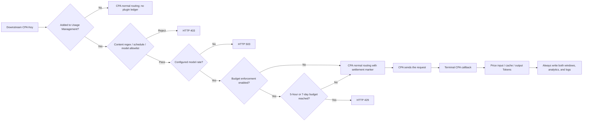

# codex-carpool

[简体中文](README.md) | **English**

> A Linux-native CLIProxyAPI / CPA plugin that meters managed API Keys across all CPA models in USD.


## Overview

`codex-carpool` owns only actual usage and USD budgets for Keys added to Usage Management. It does not maintain an account pool, read official percentage snapshots, or use multiplier/point accounting. Request excerpts, models, Tokens, cost, and both fixed cycles are recorded in both **Budget enforced** and **Track only** modes; the only difference is whether an over-budget request returns `429`.

CPA remains responsible for credentials and routing. A Key that has not been added keeps CPA's normal behavior. External traffic is ignored and can never be attributed to an added Key.

## Features

- Independent fixed 5-hour and 7-day USD cycles per added Key. The first request starts each cycle, later requests never move its boundary, and the whole cycle resets at its boundary. Blank or `0` means unlimited while metering remains active.
- Complete per-model input, cache-read, cache-write, reasoning, and output prices in USD per million Tokens, including synchronized context tiers and identifiable service modes.
- Optional third-party [models.dev](https://models.dev/) synchronization is disabled by default. Enabling it refreshes immediately and every 24 hours and updates only models in CPA's current catalog. A successful refresh retires stale synchronized rates while preserving manual rates; a failed refresh preserves the complete prior card. models.dev is not official vendor pricing and should be verified before production use.
- Synchronization is limited to models currently supported by CPA. Each Key has an optional model allowlist; an empty selection means unrestricted.
- Missing model rates return `503`; a configured rate with all values set to `0` is free.
- Terminal CPA usage settlement normalizes input, cache reads, cache writes, output, reasoning, and service tier for Codex/OpenAI, Claude/Anthropic, and Gemini before calculating USD. A requested model alias uses that alias's manually configured rate.
- If CPA reports no actual Tokens, the request is recorded as incomplete with zero Token and USD usage; no fixed estimate is substituted.
- A registered Key in Track-only mode still records request excerpts, models, input/cache/output Tokens, USD cost, CPA AuthID, and both fixed cycles; over-budget requests continue.
- Content-regex blocking is enabled by default with built-in and custom RE2 expressions. Usage trends support hourly, daily, monthly, and yearly views.
- CPA-host style isolation for inputs, dialogs, tables, themes, and sticky operation columns.

## Content-filter scope

- Case-insensitive RE2 rules cover explicit harmful requests in simplified/traditional Chinese, English, Japanese, Korean, Russian, Spanish, French, German, Portuguese, Italian, Arabic, and Hindi. Coverage varies by language; this is not all-language or all-paraphrase detection.
- Multilingual rules target license/payment circumvention, credential theft, malware creation, weapons manufacture, sexual exploitation of minors, and self-harm instructions. Additional Chinese/English patterns cover fraud, privacy abuse, harassment, hateful incitement, sexual violence, explicit pornography generation, terrorism, and human trafficking.
- Face-swap/deepfake rules cover pornographic impersonation, non-consensual nudification, voice/face impersonation scams, and facial/liveness-verification circumvention. Consensual film effects, authorized voice-over, and deepfake detection are not blocked merely by their tool names.
- Categories reference [OpenAI moderation documentation](https://developers.openai.com/api/docs/guides/moderation) and [cybersecurity checks](https://developers.openai.com/api/docs/guides/safety-checks/cybersecurity). These are locally maintained patterns, not an OpenAI-supplied regex catalog, official moderation service, or complete policy implementation. License circumvention is an additional operator restriction; reverse engineering, decompilation, CTFs, and security research alone are not blocked.
- New patterns combine sentence-initial requests with concrete harmful targets to reduce false positives. There is no global research/testing exemption. Regex cannot reliably interpret quotations, negation, context, arbitrary obfuscation, or image pixels. Operators can disable individual rules or add custom expressions.
- On upgrade/restart, new builtins are added without overriding saved global or per-rule switches. Fresh databases default to enabled. Filtering applies only to added Keys, including Track-only Keys; matches return `403` and create dedicated content-block logs. No external moderation calls or request uploads are added.

## Metering flow



## Seed rate card

When the database has no model rates, the first startup seeds these entries once. Saving the rate card later is fully operator-owned and never overwritten on startup:

- `gpt-5.3-codex-spark`
- `gpt-5.4-mini`
- `gpt-5.6-sol`
- `gpt-5.6-luna`
- `gpt-image-1.5`
- `gpt-image-2` (all rates are `0`)

All values use USD per million Tokens. Edit them in **Rate settings** after synchronizing CPA's model catalog.

## Data and security boundary

- Raw CPA API Keys are never persisted; only an HMAC fingerprint and the final four characters are stored.
- Only a bounded user-request excerpt is retained. Image generation reads the JSON `prompt`; image editing reads the multipart `prompt`. Image binaries, Base64 data, system prompts, tool content, and model responses are never stored.
- An unmanaged usage callback is ignored before it can update a managed Key's Token ledger, dollar ledger, or statistics.
- Plugin data is stored in `/CLIProxyAPI/plugins/codex-carpool/data/codex-carpool.db`.
- The current release uses a new dollar-meter schema and does not read or migrate an earlier metering database; deploy it with a new empty database.
- Safe plugin reload checkpoints unresolved callback markers so they can settle at the original request time and rate after reload.
- Budgets settle from actual usage after CPA completes and reports a request. Concurrent requests can pass admission before any one of them settles, so the budget is a settled-usage threshold and a gate for subsequent requests, not a pre-authorized hard cap for one request or concurrent in-flight traffic.
- CPA remains responsible for credentials and scheduling; this plugin does not create or edit account pools.

## Requirements and build

- Linux amd64, Go 1.26+, CGO compiler, `make`, `zip`, and a CLIProxyAPI v7 plugin environment.

```bash
chmod +x build-linux.sh
VERSION=0.5.20 ./build-linux.sh
```

The script verifies dependencies, runs unit and race tests, runs `go vet`, and creates the shared library and ZIP package.

## Installation

```bash
install -D -m 0755 \
  dist/codex-carpool_0.5.20.so \
  /CLIProxyAPI/plugins/linux/amd64/codex-carpool_0.5.20.so

mkdir -p /CLIProxyAPI/plugins/codex-carpool/data
chmod 700 /CLIProxyAPI/plugins/codex-carpool/data
```

CPA only loads the plugin:

```yaml
plugins:
  enabled: true
  dir: /CLIProxyAPI/plugins
  configs:
    codex-carpool:
      enabled: true
      priority: 100
```

Remove older shared libraries with the same plugin name before restarting CPA. Keep the plugin data directory writable.

## First setup

1. Open `/v0/resource/plugins/codex-carpool/panel` in CPAMP.
2. Click **Sync CPA Keys and models**.
3. Open **Rate settings** and either maintain the complete prices manually or enable models.dev price synchronization. Unmatched aliases remain manually configurable.
4. Add a Key, select its allowed models, and set 5-hour and 7-day USD budgets. Blank or `0` means unlimited. Track-only mode still calculates all windows and cost but does not reject over-budget traffic.
5. Verify Token and USD settlement in usage logs; runtime logs record synchronization, rate saves, and settlement events.

## Management routes

| Method | Route | Purpose |
| --- | --- | --- |
| GET / PUT | `/v0/management/codex-carpool/setup` | Plugin retention and runtime settings |
| GET | `/v0/management/codex-carpool/summary` | Key dollar windows, settled Tokens, and status |
| GET / POST / PUT / DELETE | `/v0/management/codex-carpool/keys` | Managed-Key policies |
| POST | `/v0/management/codex-carpool/keys/reset?key_id=...` | Reset one Key's dollar usage while keeping logs |
| GET | `/v0/management/codex-carpool/analysis?key_id=...` | Per-Key settled Token analysis |
| GET / DELETE | `/v0/management/codex-carpool/logs?key_id=...` | Usage-log query and clear |
| GET / DELETE | `/v0/management/codex-carpool/operation-logs` | Runtime-log query and clear |
| GET / PUT | `/v0/management/codex-carpool/content-filter` | Forbidden-phrase settings |
| GET / DELETE | `/v0/management/codex-carpool/forbidden-logs` | Forbidden-phrase log query and clear |
| GET / PUT | `/v0/management/codex-carpool/models` | CPA model catalog synchronization |
| GET / PUT | `/v0/management/codex-carpool/rates` | Complete per-model Token prices |
| PUT | `/v0/management/codex-carpool/rate-sync` | Toggle models.dev price synchronization |

## Release checks

- Unmanaged Keys still use CPA's normal scheduler.
- A model without a rate returns `503`; a configured all-zero rate is free.
- Reaching either USD window returns `429` until the window recovers.
- A terminal callback creates matching input/cache/output Token and USD records.
- A registered Track-only Key still applies content, schedule, model, and rate checks and accumulates Tokens, cost, and both windows; only over-budget rejection is skipped.
- External traffic never appears in managed-Key statistics.
- Rates, policies, dollar ledgers, and logs survive a CPA restart.

## License

Released under the repository [LICENSE](LICENSE).
