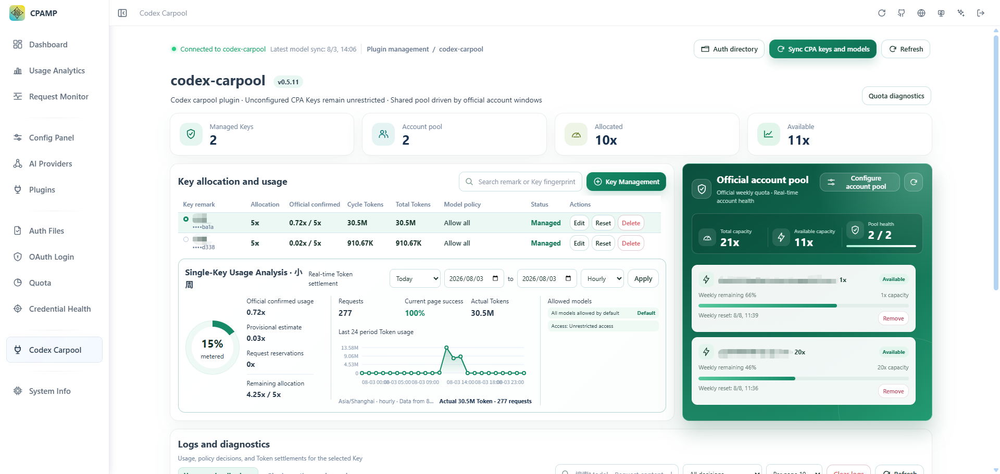
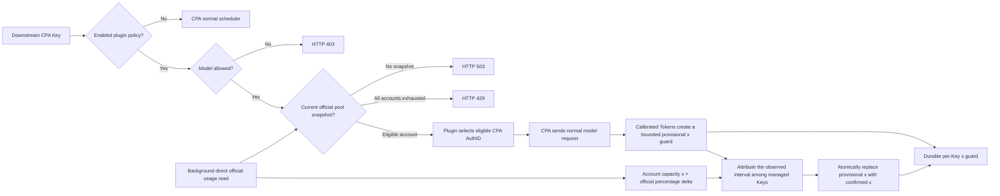

# codex-carpool

[简体中文](README.md) | **English**

> A Linux native Codex account-pooling and per-Key quota plugin for CLIProxyAPI / CPA.


`codex-carpool` is a Linux native plugin for [CLIProxyAPI](https://github.com/router-for-me/CLIProxyAPI). It is a **Codex shared-account plugin**: configured downstream API Keys share a pool of configured Codex accounts, while Codex's official weekly percentage and reset time remain the hard quota source. If Codex exposes additional official windows, the panel may display them, but a missing window is not invented locally.

The panel is a right-side content page. CPA / CPAMP continues to own the left navigation, authentication files, API Keys, and theme; this plugin owns only its SQLite policies, official quota snapshots, usage buckets, and compact audit logs.

## Interface preview



## Highlights

- Operator-defined shared account capacities such as `1x` and `20x`.
- One global x allocation per managed CPA Key across all configured accounts.
- Direct official quota synchronization and capacity-aware account switching.
- Optional per-Key model allowlists and access schedules.
- Hourly, daily, monthly, yearly, and custom-range usage analytics.
- Separate policy/usage logs and plugin runtime/error logs.
- Chinese and English UI that follows the CPA locale and theme.
- Plugin-owned SQLite persistence without changing CPA credentials or scheduler configuration.

## Behaviour

- **No policy means no limit.** An unconfigured downstream Key stays on CPA's normal scheduler and has no per-Key plugin record. Its API Key is not retained; only a redacted account-level Token aggregate may contribute to the official-x attribution denominator.
- A managed Key has a display name, one `allocation_x` value, enabled state, and optional allowed-model set. An empty model set means all CPA-synchronized Codex models are allowed; a blocked model returns HTTP `403`.
- Each enabled Codex account is added to the plugin-owned shared pool with an operator-entered capacity such as `1x` or `20x`. Key allocations use exactly the same x unit. For example, if a configured `20x` account's official weekly usage rises by 5 percentage points, the account has confirmed `1x` of new consumption (`20x × 5%`).
- A Key has one global x ledger across every configured account. Switching from a `1x` account to a `20x` account does not reset or duplicate that Key's allowance. Before an account has a trustworthy official calibration, completed Tokens remain analytics only and do not consume guessed x. Afterwards they may create a provisional x guard, capped per Key/account at 1% of that account's configured capacity between measurable official percentage changes. Unmanaged CPA traffic remains in the account denominator and is not charged to a managed Key.
- Official weekly percentage changes calibrate the practical Token value of one account x, but never become a managed Key's charge directly. At every successful poll the plugin atomically rebuilds the current Key ledger from that Key's own durable completed Tokens, clears covered provisional charges, and keeps the account percentage only as the shared-account hard guard. The durable watermark, provisional cleanup, and replacement charges share one SQLite transaction, so the same interval is not counted twice after retries or restarts. An explicit Codex reset retires that account's old Key sub-ledger immediately; a reset inferred from `reset_after_seconds` requires two durable observations before the same retirement, and neither path can reload the old cycle after restart. Increasing a Key's `allocation_x` takes effect immediately; a decrease takes effect after its current official weekly window resets.
- A managed request is routed only to a configured CPA scheduler candidate with a usable official snapshot. Selection prefers the account with the most capacity-weighted official headroom, so an exhausted `1x` account is skipped in favour of a usable `20x` account.
- The plugin scans CPA's file-backed `auth-dir` (default `~/.cli-proxy-api`) and reads the selected Codex JSON credential by the same auth-dir-relative ID used by CPA scheduling. The temporary OAuth token is never persisted or returned to the browser. This removes all native `host.auth.*` callbacks, so a blocked CPA callback cannot hold plugin shutdown open. The direct official request has a 15-second timeout, a 1 MiB response bound, and does **not** enter CPA's proxy scheduler, request monitor, or downstream usage pipeline. If this host requires egress proxying, configure standard `HTTPS_PROXY` / `HTTP_PROXY` environment variables for the CPA process; CPA's model proxy settings are intentionally not reused.
- An upstream Codex `429` with the official `usage_limit_reached` signal marks the selected account unavailable immediately and refreshes it in the background. Other transient `429` responses only trigger a refresh and do not freeze the shared pool. If no configured account has a usable official snapshot, the managed Key receives `429`; if snapshots have not been obtained yet, it receives `503` rather than risking a false allow.
- The synchronizer runs at startup, when a request observes a stale snapshot, every five minutes, after an account change, and after `429`. It uses three bounded workers plus a global request spacing and a 30-second manual-refresh cooldown, so scheduler calls never wait for official quota I/O or create a polling burst. Manual refresh returns `202` only when at least one account was actually queued; unavailable, already-running, or queue-full accounts are returned explicitly.
- Per-Key completed Token buckets and decision logs are independent plugin data. For managed Keys, a decision log may contain the latest user-authored text excerpt (maximum 2,000 Unicode characters) captured from that request. Raw request bodies, system/developer/tool content, files, images, responses, raw API Keys, and OAuth tokens are not stored.
- Plugin lifecycle, account-pool changes, model synchronization, official-quota failures, recoveries, and exhaustion events are retained separately as operational logs. They are visible in the panel, share the configured retention period, and are deliberately rate-limited so a broken upstream link cannot create an unbounded write stream.



## Configuration and persistence

CLIProxyAPI only loads the native plugin. Account-pool capacities, Key allocations, policies, snapshots, model catalog, logs, and the HMAC fingerprint secret are stored only in plugin SQLite; do not add them to CPA YAML.

On the first panel visit, confirm **认证目录**. It defaults to CPA's standard `~/.cli-proxy-api`; when CPA uses a custom `auth-dir`, set that exact directory once in the plugin. The directory is read-only from the plugin's perspective, must be accessible to the CPA process, and supports file-backed Codex accounts only (not runtime-only credentials that CPA has never written to disk). JSON soft links are supported only when their final target remains under `auth-dir`; links escaping it are rejected. Discovery and account-pool saves deduplicate both the resolved physical file and the credential's stable Codex `account_id`, so copied JSON files cannot assign capacity to one official account twice. A file without a stable account identity may be used only as the pool's sole enabled account; it cannot be combined with another account because the plugin cannot prove that they are distinct. Historical duplicates are fail-closed for managed Keys until corrected. Source identity is rechecked independently every 15 seconds and every account/auth-dir change first closes managed admissions; unchanged files reuse a process-only identity fingerprint instead of being parsed again. Any stale or incomplete scan remains closed, and only a complete current-generation scan can reopen the pool. During CPA's short non-atomic JSON rewrite window, only an unexpired in-memory credential for the same resolved file may be reused; disabled, missing, invalid, or retargeted credentials still fail closed. Native shutdown waits up to 20 seconds for terminal usage. If a callback is still missing, its small durable correlation marker remains conservative until that official window resets; it is not converted into a guessed Token charge. Use a healthy host-local filesystem rather than NFS/FUSE or another remote mount: Go cannot safely cancel a blocked filesystem syscall during native plugin shutdown. Account discovery and quota refresh use this directory; the panel's CPA Key/model synchronization continues to use normal same-origin management HTTP.

```yaml
plugins:
  enabled: true
  dir: /CLIProxyAPI/plugins
  configs:
    codex-carpool:
      enabled: true
      priority: 100
```

Plugin data is fixed at:

```text
/CLIProxyAPI/plugins/codex-carpool/data/codex-carpool.db
```

The directory is created with `0700`; the SQLite/WAL database uses `0600` and a single-instance lock. Do not mount it read-only or share it between two CPA processes. Old `codex-quota-guard` databases can be copied once without modifying their source. Legacy percentage/group rows remain paused and require a CPA Key rebind, so they never unexpectedly limit traffic. The first build that introduced the legacy official-percentage x ledger cleared only incompatible historical allocation-guard rows and established a new official percentage baseline. The aligned-calibration upgrade also clears the old reproducible Token/x calibration cache and its derived provisional x once; current successful quota polls replace any remaining percentage-derived Key charge from durable actual Tokens without clearing pending request reservations, Key policies, actual-Token analysis, audit logs, account snapshots, or model data.

## Management routes

| Method | Route | Purpose |
| --- | --- | --- |
| GET / PUT | `/v0/management/codex-carpool/setup` | plugin retention and legacy accounting settings |
| GET | `/v0/management/codex-carpool/summary` | Key analysis, pool allocation, and official snapshots |
| GET / POST / PUT / DELETE | `/v0/management/codex-carpool/keys` | list, save, or stop managing Key policies |
| POST | `/v0/management/codex-carpool/keys/reset?key_id=...` | reset one Key's plugin-owned quota and usage statistics while preserving its policy and all logs |
| GET | `/v0/management/codex-carpool/records?key_id=...` | compact per-Key Token buckets |
| GET | `/v0/management/codex-carpool/trend?key_id=...&window=five|seven` | legacy bounded per-Key completed-Token trend |
| GET | `/v0/management/codex-carpool/analysis?key_id=...&from=...&to=...&granularity=day` | per-Key actual-Token analysis for day, month, year, or a custom range |
| GET / DELETE | `/v0/management/codex-carpool/logs?key_id=...` | list or clear one Key's policy and completion logs without changing its quota |
| GET / DELETE | `/v0/management/codex-carpool/operation-logs?level=error` | list or clear plugin runtime and error logs without changing Key quota |
| GET / PUT | `/v0/management/codex-carpool/models` | CPA-synchronized Codex model catalog |
| GET / PUT / DELETE | `/v0/management/codex-carpool/accounts` | configured shared-pool account entries |
| GET | `/v0/management/codex-carpool/accounts/discover` | CPA Codex accounts that can be added |
| POST | `/v0/management/codex-carpool/accounts/refresh` | schedule direct official quota refresh |

Open the panel at:

```text
/v0/resource/plugins/codex-carpool/panel
```

It uses CPAMP's same-origin management session and observes surrounding Element Plus theme tokens. The browser only receives masked Key fingerprints and account suffixes.

## Build and release

Build on Linux amd64 with Go 1.26+, a C compiler, and `zip`:

```bash
go mod tidy
make test
make package VERSION=1.0.0
```

Each build emits a versioned shared library, for example `dist/codex-carpool_0.3.3.so`, and the same version is visible in the plugin panel. Deploy that exact file to `/CLIProxyAPI/plugins/linux/amd64/`. Remove previous `codex-carpool*.so` files from that plugin directory before restarting CPA, so it never loads two versions with the same logical plugin name. Keep the data directory writable. Before production rollout verify: unconfigured Keys bypass the plugin; a restricted model returns `403`; a just-added account obtains an official snapshot; a Key reaches its allocation guard and returns `429`; an exhausted account is skipped for another eligible account; and only `usage_limit_reached` pauses an account until refresh reports it usable again.
