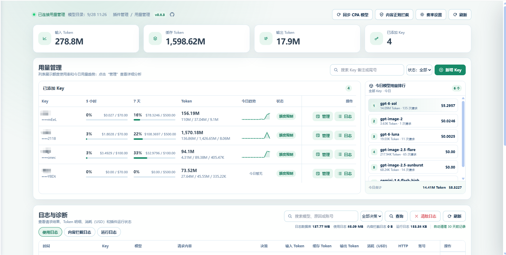
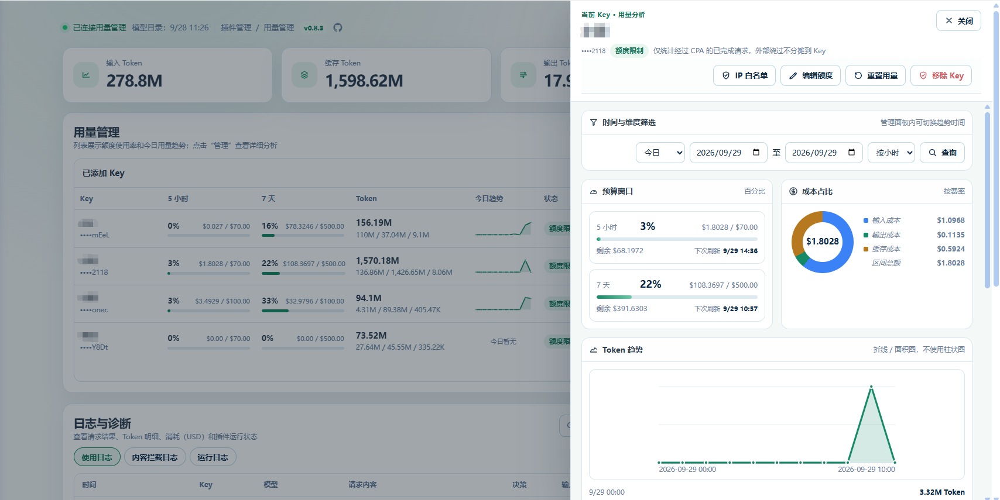
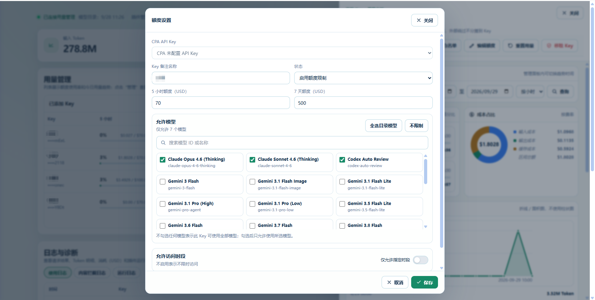
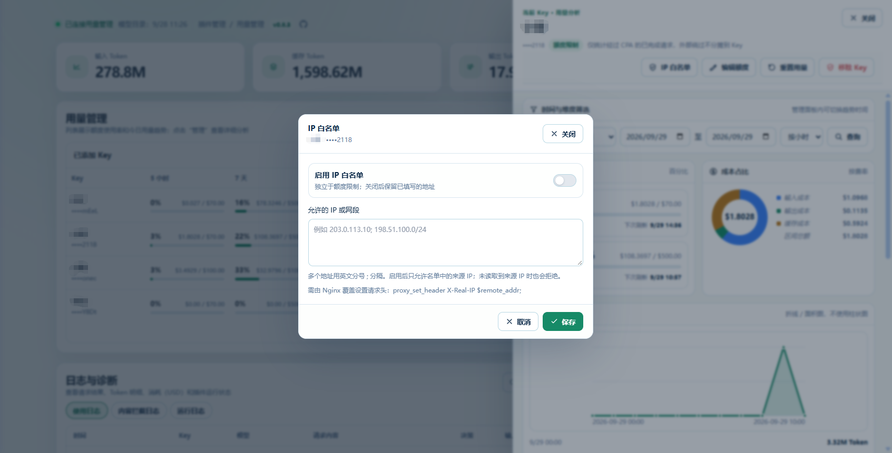
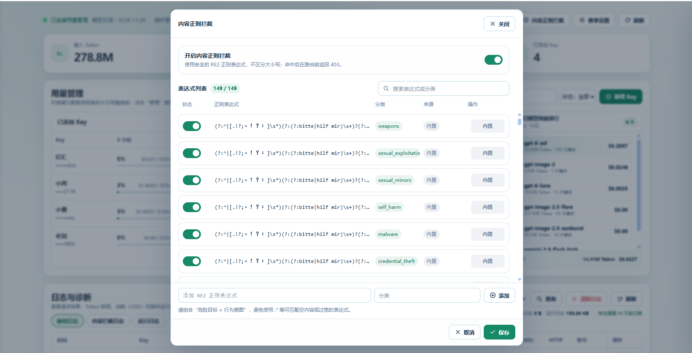
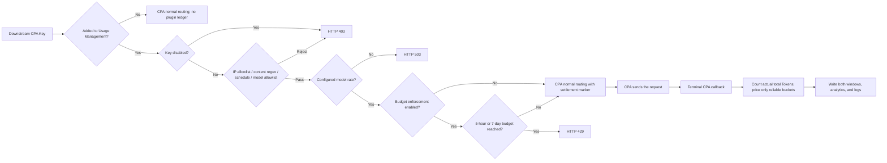

# codex-carpool

[简体中文](README.md) | **English**

> A Linux-native CLIProxyAPI / CPA plugin that meters managed API Keys across all CPA models in USD.


## Overview

`codex-carpool` owns only actual usage and USD budgets for Keys added to Usage Management. It does not maintain an account pool, read official percentage snapshots, or use multiplier/point accounting. Request excerpts, models, Tokens, cost, and both fixed cycles are recorded in both **Budget enforced** and **Track only** modes; the only difference is whether an over-budget request returns `429`. **Disabled** rejects every model request for the Key while retaining its request log.

CPA remains responsible for credentials and routing. A Key that has not been added keeps CPA's normal behavior. External traffic is ignored and can never be attributed to an added Key.

## Screenshots

These screenshots show the Chinese interface; budgets, models, and usage depend on the deployment.

### Overview and logs

The dashboard combines 5-hour and 7-day budgets, Tokens, today's trend, and an all-Key daily model ranking. Usage, content-block, and runtime logs are available below.



### Per-Key analysis

The Manage drawer provides time/granularity filters, budget reset times, cost breakdown, Token trends, and request history.



### Key policy and independent IP allowlist

The policy editor controls Key state, budgets, CPA-supported model selection, and optional access hours. The IP allowlist has its own switch and retains its entries when disabled.





### Content-regex filter

Search, enable, or disable built-in and custom RE2 expressions; the add-expression form stays visible beneath the scrolling list.



## Features

- Independent fixed 5-hour and 7-day USD cycles per added Key. The first request starts each cycle, later requests never move its boundary, and the whole cycle resets at its boundary. Blank or `0` means unlimited while metering remains active.
- Complete per-model input, cache-read, cache-write, reasoning, and output prices in USD per million Tokens, including synchronized context tiers and identifiable service modes.
- Optional third-party [models.dev](https://models.dev/) synchronization is disabled by default. Enabling it refreshes immediately and every 24 hours, matching CPA's current catalog and model IDs added manually to the rate card; adding a model also queues a refresh. Synchronization dynamically identifies the original lab from model metadata and accepts only that lab's exact-ID entry with complete Token prices; it neither guesses from model-name prefixes nor uses reseller prices. A model removed from CPA no longer stays in sync merely because it has an old synchronized rate; manually added models retain their origin marker. Unmatched manual rates remain, and a failed refresh preserves the complete prior card. models.dev is not official vendor pricing and should be verified before production use.
- Key model allowlists use only CPA's currently supported catalog; model IDs can also be added manually to the rate card for price matching. Each Key has an optional allowlist; an empty selection means unrestricted.
- Missing model rates return `503`; a configured rate with all values set to `0` is free.
- Terminal CPA usage settlement normalizes input, cache reads, cache writes, output, reasoning, and service tier for Codex/OpenAI, Claude/Anthropic, and Gemini before calculating USD. A requested model alias uses that alias's manually configured rate.
- Total Tokens remain counted when CPA reports a total without a complete breakdown. Reliably priced known buckets contribute only their own cost; unclassified Tokens are not estimated. Contradictory buckets or missing buckets that could change a price tier leave the request unpriced. If CPA reports no actual Tokens at all, no fixed Token or USD estimate is substituted.
- A registered Key in Track-only mode still records request excerpts, models, actual Tokens, priced USD cost, CPA AuthID, and both fixed cycles; over-budget requests continue.
- A Disabled Key returns `403` before model, rate, and CPA routing. No model Tokens or cost are produced, while the Key, model, bounded request excerpt, and rejection reason remain in request logs.
- Each added Key has an independent IP allowlist switch, accepting IPv4/IPv6 addresses and CIDR ranges separated by semicolons. It works in both Budget-enforced and Track-only modes; disabling the switch retains its entries. An enabled allowlist rejects missing or nonmatching source IPs and records the rejection. A trusted reverse proxy must overwrite `X-Real-IP`, for example with Nginx `proxy_set_header X-Real-IP $remote_addr;`.
- Content-regex blocking is enabled by default with built-in and custom RE2 expressions. Optional per-Key access hours and hourly, daily, monthly, and yearly usage trends are available.
- The all-Key daily model ranking shows Tokens, priced USD, and request counts. Per-Key request logs have time-range and keyword filters and pagination. The panel shows database and separate usage, content-block, and runtime-log sizes; records older than 30 days are automatically pruned, with effective cleanup recorded in the runtime log.
- CPA-host style isolation for inputs, dialogs, tables, themes, and sticky operation columns.

## Content-filter scope

- Case-insensitive RE2 rules cover explicit harmful requests in simplified/traditional Chinese, English, Japanese, Korean, Russian, Spanish, French, German, Portuguese, Italian, Arabic, and Hindi. Coverage varies by language; this is not all-language or all-paraphrase detection.
- Multilingual rules target license/payment circumvention, credential theft, malware creation, weapons manufacture, sexual exploitation of minors, and self-harm instructions. Additional Chinese/English patterns cover fraud, privacy abuse, harassment, hateful incitement, sexual violence, explicit pornography generation, terrorism, and human trafficking.
- Face-swap/deepfake rules cover pornographic impersonation, non-consensual nudification, voice/face impersonation scams, and facial/liveness-verification circumvention. Consensual film effects, authorized voice-over, and deepfake detection are not blocked merely by their tool names.
- Categories reference [OpenAI moderation documentation](https://developers.openai.com/api/docs/guides/moderation) and [cybersecurity checks](https://developers.openai.com/api/docs/guides/safety-checks/cybersecurity). These are locally maintained patterns, not an OpenAI-supplied regex catalog, official moderation service, or complete policy implementation. License circumvention is an additional operator restriction; reverse engineering, decompilation, CTFs, and security research alone are not blocked.
- New patterns combine sentence-initial requests with concrete harmful targets to reduce false positives. There is no global research/testing exemption. Regex cannot reliably interpret quotations, negation, context, arbitrary obfuscation, or image pixels. Operators can disable individual rules or add custom expressions.
- On upgrade/restart, new builtins are added without overriding saved global or per-rule switches. Fresh databases default to enabled. Filtering applies only to added Keys, including Track-only Keys; matches return `403` and create dedicated content-block logs. No external moderation calls or request uploads are added.

## Metering flow


```mermaid
flowchart LR
    K["Downstream CPA Key"] --> P{"Added to Usage Management?"}
    P -- No --> N["CPA normal routing; no plugin ledger"]
    P -- Yes --> D{"Key disabled?"}
    D -- Yes --> E403["HTTP 403; log the request"]
    D -- No --> F{"IP allowlist / content regex / schedule / model allowlist"}
    F -- Reject --> E403["HTTP 403"]
    F -- Pass --> R{"Configured model rate?"}
    R -- No --> E503["HTTP 503"]
    R -- Yes --> M{"Budget enforcement enabled?"}
    M -- No --> C["CPA normal routing with settlement marker"]
    M -- Yes --> B{"5-hour or 7-day budget reached?"}
    B -- Yes --> E429["HTTP 429"]
    B -- No --> C
    C --> U["CPA sends the request"]
    U --> S["Terminal CPA callback"]
    S --> L["Count actual total Tokens; price only reliable buckets"]
    L --> W["Write both windows, analytics, and logs"]
```

## Seed rate card

When the database has no model rates, the first startup seeds these entries once. Saving the rate card later is fully operator-owned and never overwritten on startup:

- `gpt-5.3-codex-spark`
- `gpt-5.4-mini`
- `gpt-5.6-sol`
- `gpt-5.6-luna`
- `gpt-image-1.5`
- `gpt-image-2` (all rates are `0`)

All values use USD per million Tokens. Edit them in **Rate settings** after synchronizing CPA's model catalog.

## Data and security boundary

- Raw CPA API Keys are never persisted; only an HMAC fingerprint and the final four characters are stored.
- Only a bounded user-request excerpt is retained. Image generation reads the JSON `prompt`; image editing reads the multipart `prompt`. Image binaries, Base64 data, system prompts, tool content, and model responses are never stored.
- An unmanaged usage callback is ignored before it can update a managed Key's Token ledger, dollar ledger, or statistics.
- Plugin data is stored in `/CLIProxyAPI/plugins/codex-carpool/data/codex-carpool.db`.
- Existing installations on this dollar-meter schema receive additive columns on startup. Migration from older, different metering schemas is not guaranteed; back up the database before upgrading. A fresh installation creates its own empty database.
- Safe plugin reload checkpoints unresolved callback markers so they can settle at the original request time and rate after reload.
- Budgets settle from actual usage after CPA completes and reports a request. Concurrent requests can pass admission before any one of them settles, so the budget is a settled-usage threshold and a gate for subsequent requests, not a pre-authorized hard cap for one request or concurrent in-flight traffic.
- CPA remains responsible for credentials and scheduling; this plugin does not create or edit account pools.

## Build environment

- Build on Linux amd64 with Go 1.26+ (required by this repository's `go.mod`), a CGO-capable C compiler, `make`, `zip`, and Git.
- Run on a CPA installation with native-plugin, management-API, and terminal-usage-callback support. No fixed CPA version number is imposed here: verify registration, request interception, settlement callbacks, and the management panel against the CPA version you actually run. Older builds lacking these capabilities cannot load this plugin.

On Debian / Ubuntu Linux amd64, install the system build tools:

```bash
sudo apt-get update
sudo apt-get install -y build-essential make zip git ca-certificates
```

Install Go 1.26 or newer using the [official Linux instructions](https://go.dev/doc/install); your distribution's package may be too old. Then verify the environment:

```bash
go version
go env GOOS GOARCH CGO_ENABLED
gcc --version
make --version
zip -v
```

The build target must be `linux/amd64`, with `CGO_ENABLED` set to `1`; if it shows `0`, run `export CGO_ENABLED=1` before building. SQLite and the native shared library require CGO and a C compiler. Node.js and Python are not required; on other Linux distributions, install equivalent packages.

## Build

For a fresh checkout:

```bash
git clone https://github.com/lucky98556/codex-carpool.git
cd codex-carpool
```

From the repository root:

```bash
chmod +x build-linux.sh
VERSION=0.8.3 ./build-linux.sh
```

`0.8.3` is the version shown in the screenshots; replace it with the version you are publishing. The script verifies dependencies, runs unit and race tests, runs `go vet`, and creates the shared library and ZIP package.

## Installation

This example assumes CPA sees `/CLIProxyAPI/plugins` as its plugin directory. For 1Panel / Docker, mount the host plugin directory there and persist the data directory. Back up the database before upgrading and avoid loading two shared libraries with the same plugin ID.

```bash
VERSION=0.8.3
install -D -m 0755 \
  "dist/codex-carpool_${VERSION}.so" \
  "/CLIProxyAPI/plugins/linux/amd64/codex-carpool_${VERSION}.so"

mkdir -p /CLIProxyAPI/plugins/codex-carpool/data
chmod 700 /CLIProxyAPI/plugins/codex-carpool/data
```

CPA only loads the plugin:

```yaml
plugins:
  enabled: true
  dir: /CLIProxyAPI/plugins
  configs:
    codex-carpool:
      enabled: true
      priority: 100
```

After restarting CPA, confirm that **Usage Management** is registered and enabled in Plugin Management. Open the panel and send a test request to verify the log and actual Token settlement. After verifying the new file and database backup, move any older same-ID shared libraries out of the scan directory. Keep the data directory writable.

## First setup

1. Open **Usage Management** in CPA's management panel, or visit `/v0/resource/plugins/codex-carpool/panel`.
2. Click **Sync CPA models** and verify the catalog comes from the running CPA installation.
3. Open **Rate settings** and either maintain the complete prices manually or enable models.dev price synchronization. Unmatched aliases remain manually configurable.
4. Add a Key, select its state, allowed models, optional access hours, and 5-hour and 7-day USD budgets. Blank or `0` means unlimited. Track-only mode still calculates both windows and reliably priced cost without over-budget rejection; Disabled rejects every model request while retaining request logs.
5. If needed, configure and independently enable addresses or ranges under **Manage → IP allowlist**; it also applies without budget enforcement.
6. Check actual Tokens and priced USD in usage logs, then inspect per-Key analysis, the daily model ranking, and runtime logs.

## Management routes

| Method | Route | Purpose |
| --- | --- | --- |
| GET / PUT | `/v0/management/codex-carpool/setup` | Plugin retention and runtime settings |
| GET | `/v0/management/codex-carpool/summary` | Key dollar windows, settled Tokens, and status |
| GET / POST / PUT / DELETE | `/v0/management/codex-carpool/keys` | Managed-Key policies |
| PUT | `/v0/management/codex-carpool/keys/ip-whitelist` | Independent per-Key IP allowlist and switch |
| POST | `/v0/management/codex-carpool/keys/reset?key_id=...` | Reset one Key's dollar usage while keeping logs |
| GET | `/v0/management/codex-carpool/analysis?key_id=...` | Per-Key settled Token analysis |
| GET | `/v0/management/codex-carpool/model-ranking` | All-Key daily model ranking |
| GET / DELETE | `/v0/management/codex-carpool/logs?key_id=...` | Usage-log query and clear |
| GET | `/v0/management/codex-carpool/log-storage` | Database and three log-class sizes |
| GET / DELETE | `/v0/management/codex-carpool/operation-logs` | Runtime-log query and clear |
| GET / PUT | `/v0/management/codex-carpool/content-filter` | Forbidden-phrase settings |
| GET / DELETE | `/v0/management/codex-carpool/forbidden-logs` | Forbidden-phrase log query and clear |
| GET / PUT | `/v0/management/codex-carpool/models` | CPA model catalog synchronization |
| GET / PUT | `/v0/management/codex-carpool/rates` | Complete per-model Token prices |
| PUT | `/v0/management/codex-carpool/rate-sync` | Toggle models.dev price synchronization |

## Release checks

- Unmanaged Keys still use CPA's normal scheduler.
- A model without a rate returns `503`; a configured all-zero rate is free.
- Reaching either USD window returns `429` until the window recovers.
- A terminal callback counts actual total Tokens in logs and both windows; incomplete buckets show only reliably priced cost, never a guess derived from the total.
- A registered Track-only Key still applies content, schedule, model, and rate checks and accumulates Tokens, cost, and both windows; only over-budget rejection is skipped.
- A Disabled Key returns `403` for every model while its request log retains the Key, model, request excerpt, and `key_disabled` reason.
- An enabled IP allowlist admits only listed source IPs; switching between Budget-enforced and Track-only does not change its switch.
- The panel shows each log class's size; records older than 30 days are pruned automatically, and an effective cleanup leaves a runtime-log entry.
- External traffic never appears in managed-Key statistics.
- Rates, policies, dollar ledgers, and logs survive a CPA restart.

## License

Released under the repository [LICENSE](LICENSE).
