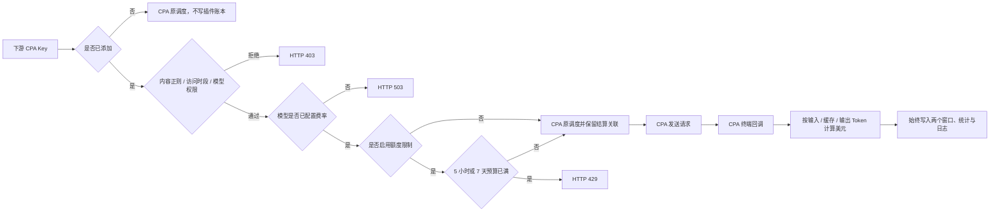

# codex-carpool

**简体中文** | [English](README.en.md)

> 面向 [CLIProxyAPI](https://github.com/router-for-me/CLIProxyAPI) / CPA 的 Linux 原生全模型 Key 美元计量插件。


## 项目简介

插件只管理已添加下游 Key 的实际用量与美元预算，不维护账号池、不读取官方百分比、不使用倍率或积分。Key 添加后，无论选择“额度限制”还是“仅统计”，请求正文摘要、模型、Token、费用以及 5 小时和 7 天窗口都会持续记录；两种状态的区别只是超额后是否返回 `429`。

CPA 仍负责认证文件和实际调度。未添加的 Key 保持 CPA 原有行为，外部流量不会写入插件，也不会被分摊到任何已添加 Key。

## 核心能力

- **5 小时 / 7 天独立美元预算**：每个 Key 分别配置两个窗口；留空或填 `0` 表示不限制。
- **人工维护模型费率**：按模型配置输入、缓存输入、输出三项 USD / 百万 Token 价格。费率表为空时仅初始化一次内置种子；之后完全以人工保存的费率为准。
- **模型目录与权限**：只同步 CPA 当前实际支持的模型；每个 Key 可单独选择允许模型，不勾选表示不限制。未配置费率的模型暂停调用，三项价格全部为 `0` 即免费。
- **实际 Token 结算**：终端 CPA 回调提供输入、缓存、输出 Token，按费率计算美元并立即写入 5 小时与 7 天窗口。
- **不做估算扣费**：CPA 未返回实际 Token 时按未完成请求记录，Token 与消耗（USD）均为 `0`，不会使用固定值代替。
- **完整审计**：添加到插件的 Key 即使选择“仅统计”，仍记录请求正文摘要、模型、输入/缓存/输出 Token、消耗（USD）、CPA AuthID 和两个滚动窗口；超额请求继续放行。
- **内容正则拦截、访问时段、用量分析**：内容拦截默认开启，使用内置及自定义 RE2 正则；趋势支持按小时、日、月、年查询。这些能力只作用于已添加 Key。
- **CPA 样式隔离**：面板控件、搜索框、弹窗、表格和固定操作列均在插件作用域内适配明暗主题。

## 计量流程



## 内置模型费率种子

首次启动且数据库中没有任何费率时，插件会写入以下模型；后续人工保存不会被启动流程覆盖：

- `gpt-5.3-codex-spark`
- `gpt-5.4-mini`
- `gpt-5.6-sol`
- `gpt-5.6-luna`
- `gpt-image-1.5`
- `gpt-image-2`（输入、缓存、输出均为 `0`）

价格单位统一为 USD / 百万 Token。需要调整价格时，在面板的“费率设置”中修改并保存。

## 数据与安全边界

- 原始 CPA API Key 不持久化，只保存 HMAC 指纹和最后四位展示信息。
- 只记录最新的用户请求文本摘要；图片生成读取 JSON `prompt`，图片编辑读取 multipart `prompt`，不会保存图片二进制、Base64、系统提示、工具内容或模型响应正文。
- 外部 Key 的回调在识别为非受管后直接忽略，不写入受管 Key 的用量、美元账本或统计。
- 数据只写入插件自己的 SQLite 目录：`/CLIProxyAPI/plugins/codex-carpool/data/codex-carpool.db`。
- 当前数据库是新美元计费结构，不读取或迁移此前的计量数据库；首次部署请使用新的空数据库。
- 插件安全重载时会检查点保存尚未收到终态回调的关联标记，重载后仍按原请求时间和原费率结算。
- CPA 认证文件和调度器仍由 CPA 管理；插件不会创建或编辑账号池。

## 环境要求

- Linux amd64
- Go 1.26+
- 启用 CGO 的 C 编译器
- `make` 与 `zip`
- CLIProxyAPI v7 插件环境

## 编译

```bash
chmod +x build-linux.sh
VERSION=0.5.20 ./build-linux.sh
```

脚本会依次执行依赖校验、单元测试、竞态测试、`go vet`，然后生成共享库和 ZIP 包。

## 安装

```bash
install -D -m 0755 \
  dist/codex-carpool_0.5.20.so \
  /CLIProxyAPI/plugins/linux/amd64/codex-carpool_0.5.20.so

mkdir -p /CLIProxyAPI/plugins/codex-carpool/data
chmod 700 /CLIProxyAPI/plugins/codex-carpool/data
```

CPA 只负责加载插件：

```yaml
plugins:
  enabled: true
  dir: /CLIProxyAPI/plugins
  configs:
    codex-carpool:
      enabled: true
      priority: 100
```

重启 CPA 前请删除插件目录中的旧版共享库，确保同名插件只加载一个版本；数据目录保持可写。

## 初次配置

1. 在 CPAMP 打开 `/v0/resource/plugins/codex-carpool/panel`。
2. 点击“同步 CPA Key 与模型”。
3. 打开“费率设置”，为 CPA 返回的模型填写输入、缓存、输出价格。
4. 新增 Key，设置允许模型和 5 小时 / 7 天美元预算；留空或 `0` 表示不限额。“仅统计”仍完整计算窗口与费用，只是不因超额拦截。
5. 使用日志确认实际 Token 和美元结算；运行日志会记录模型同步、费率保存和结算状态。

## 管理接口

| 方法 | 路由 | 用途 |
| --- | --- | --- |
| GET / PUT | `/v0/management/codex-carpool/setup` | 插件保留周期和运行设置 |
| GET | `/v0/management/codex-carpool/summary` | Key 美元窗口、已结算 Token 和状态 |
| GET / POST / PUT / DELETE | `/v0/management/codex-carpool/keys` | Key 策略管理 |
| POST | `/v0/management/codex-carpool/keys/reset?key_id=...` | 重置单个 Key 的美元用量，保留日志 |
| GET | `/v0/management/codex-carpool/analysis?key_id=...` | 单 Key 实际 Token 分析 |
| GET / DELETE | `/v0/management/codex-carpool/logs?key_id=...` | 使用日志查询与清理 |
| GET / DELETE | `/v0/management/codex-carpool/operation-logs` | 插件运行日志查询与清理 |
| GET / PUT | `/v0/management/codex-carpool/content-filter` | 内容正则设置 |
| GET / DELETE | `/v0/management/codex-carpool/forbidden-logs` | 内容拦截日志查询与清理 |
| GET / PUT | `/v0/management/codex-carpool/models` | CPA 模型目录同步 |
| GET / PUT | `/v0/management/codex-carpool/rates` | 模型输入、缓存、输出费率 |

## 上线前检查

- 未纳入管理的 Key 仍走 CPA 原调度。
- 受管 Key 的未知费率模型返回 `503`；三项费率全 `0` 的模型不扣费。
- 5 小时或 7 天美元预算达到上限时返回 `429`，窗口恢复后自动允许。
- 完成回调后，使用日志和两个美元窗口都有对应的输入、缓存、输出与费用记录。
- 选择“仅统计”的已添加 Key 仍执行内容、时段、模型和费率校验，并完整累计 Token、费用及两个窗口；仅跳过预算超额拦截。
- 不经过 CPA 的外部流量不会出现在受管 Key 统计中。
- 重启 CPA 后，费率、Key 策略、美元账本和日志仍保留。

## 许可证

本项目依据仓库中的 [LICENSE](LICENSE) 发布。
