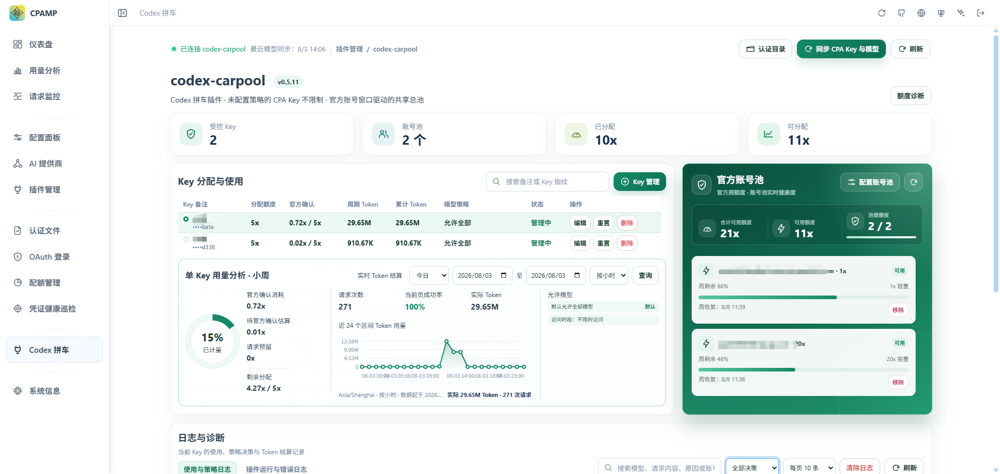
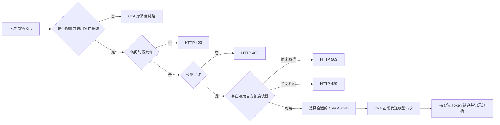

# codex-carpool

**简体中文** | [English](README.en.md)

> 面向 [CLIProxyAPI](https://github.com/router-for-me/CLIProxyAPI) / CPA 的 Linux 原生 Codex 拼车插件：统一管理共享账号池、按 Key 分配额度，并提供模型与访问时段限制、官方额度同步、用量分析和审计日志。


## 项目简介

`codex-carpool` 将多个 CPA Codex 账号组成一个共享池，并以统一的 `x` 单位向下游 CPA Key 分配使用额度。插件只负责右侧管理页面和自身数据，不修改 CPA 的左侧导航、认证文件、原始 API Key 或全局调度配置。

未配置策略的 CPA Key 保持原行为并直接走 CPA 调度；只有被纳入管理的 Key 才会进入插件的模型、时段、额度和账号选择链路。

## 界面预览



## 核心能力

- **共享账号池**：从 CPA 认证目录发现 Codex 账号，支持批量配置 `1x`、`20x` 等管理员定义容量。
- **按 Key 分配**：每个受管 Key 使用一个全局 `allocation_x`，切换账号不会重置或重复额度。
- **官方额度同步**：直接读取 Codex 官方使用窗口、剩余比例和恢复时间，官方额度始终是账号池硬边界。
- **自动账号切换**：优先选择容量加权后官方余量更充足的账号，耗尽账号会被跳过。
- **模型限制**：模型目录由 CPA 自动同步；未选择模型时默认全部允许，越权模型返回 `403`。
- **访问时段**：可限制 Key 在指定日期、星期和时间段访问；未配置时不限制。
- **用量分析**：提供单 Key 小时、日、月、年和自定义区间统计，展示实际 Token、请求次数和趋势。
- **独立日志**：使用与策略日志、插件运行与错误日志独立分页、筛选和清理；重置额度不会清除日志。
- **中英文界面**：跟随 CPA 的语言与明暗主题切换。
- **插件数据隔离**：策略、快照、用量和日志只写入插件自己的 SQLite 数据库。

## 工作方式



## 额度规则

1. 账号池容量和 Key 分配统一使用 `x`，不分别配置 5 小时或 7 天倍率。
2. 账号容量由管理员填写，例如 `1x`、`20x`；它用于共享池承诺和官方消耗归因。
3. Key 的 `x` 是跨全部账号的全局余额，不按账号比例拆分。
4. 官方百分比变化用于校准每个账号实际 `1x` 对应的 Token，不直接按账号大小缩放 Key 分配。
5. 在官方变化尚不可测时，已完成 Token 只进入分析；形成可信校准后才建立有界的临时额度守卫。
6. 增加 Key 分配即时生效；减少分配在当前官方周窗口结束后生效。
7. 官方返回 `usage_limit_reached` 会立即暂停对应账号，普通临时 `429` 只触发后台刷新。
8. 尚未取得可用快照时受管 Key 返回 `503`；Key 或账号池额度耗尽时返回 `429`。

## 数据与安全边界

- 插件从 CPA 的文件型 `auth-dir` 只读发现 Codex 认证文件。
- OAuth Token 只用于带超时的官方额度请求，不写入 SQLite，也不返回浏览器。
- 原始 CPA API Key 不持久化；插件只保存 HMAC 指纹和管理备注。
- 决策日志最多保存最后一条用户文本的 2,000 个 Unicode 字符，不保存系统、开发者、工具、文件、图片或模型响应正文。
- 官方额度请求不进入 CPA 的模型代理、请求监控或下游用量链路。
- 插件数据目录使用单实例文件锁，不应由多个 CPA 实例共享。

## 环境要求

- Linux amd64
- Go 1.26+
- 启用 CGO 的 C 编译器
- `make` 与 `zip`
- CLIProxyAPI v7 插件环境

## 编译

推荐使用仓库提供的完整构建脚本：

```bash
chmod +x build-linux.sh
VERSION=1.0.0 ./build-linux.sh
```

也可以使用 Makefile：

```bash
go mod tidy
make test
make test-race
make package VERSION=1.0.0
```

构建产物位于 `dist/`，包括共享库和 Linux amd64 ZIP 包。

## 安装

将版本化共享库复制到 CPA 插件目录：

```bash
install -D -m 0755 \
  dist/codex-carpool_1.0.0.so \
  /CLIProxyAPI/plugins/linux/amd64/codex-carpool_1.0.0.so

mkdir -p /CLIProxyAPI/plugins/codex-carpool/data
chmod 700 /CLIProxyAPI/plugins/codex-carpool/data
```

重启前请删除插件目录中的旧版 `codex-carpool*.so`，避免 CPA 同时加载两个同名插件版本。不要删除数据目录。

CPA 配置只负责加载插件：

```yaml
plugins:
  enabled: true
  dir: /CLIProxyAPI/plugins
  configs:
    codex-carpool:
      enabled: true
      priority: 100
```

插件数据固定保存到：

```text
/CLIProxyAPI/plugins/codex-carpool/data/codex-carpool.db
```

详细的 Docker 挂载、面板配置、迁移和上线检查请查看 [部署与使用说明](部署与使用说明.md)。

## 初次配置

1. 登录 CPAMP，从左侧插件入口打开 `codex-carpool`。
2. 确认认证目录；默认是 CPA 标准目录 `~/.cli-proxy-api`。
3. 在“配置账号池”中批量选择 CPA Codex 账号并填写容量 `x`。
4. 刷新官方额度，确认账号显示周剩余比例与恢复时间。
5. 点击“Key 管理”，选择 CPA Key，填写备注、分配额度、模型和访问时段。
6. 使用日志与单 Key 分析确认路由、结算和限制符合预期。

面板地址：

```text
/v0/resource/plugins/codex-carpool/panel
```

## 管理接口

| 方法 | 路由 | 用途 |
| --- | --- | --- |
| GET / PUT | `/v0/management/codex-carpool/setup` | 插件配置和日志保留设置 |
| GET | `/v0/management/codex-carpool/summary` | Key、账号池和官方快照汇总 |
| GET / POST / PUT / DELETE | `/v0/management/codex-carpool/keys` | Key 策略管理 |
| POST | `/v0/management/codex-carpool/keys/reset?key_id=...` | 重置 Key 额度和统计，保留策略与日志 |
| GET | `/v0/management/codex-carpool/analysis?key_id=...` | 单 Key 实际 Token 分析 |
| GET / DELETE | `/v0/management/codex-carpool/logs?key_id=...` | 使用与策略日志 |
| GET / DELETE | `/v0/management/codex-carpool/operation-logs` | 插件运行与错误日志 |
| GET / PUT | `/v0/management/codex-carpool/models` | CPA Codex 模型目录 |
| GET / PUT / DELETE | `/v0/management/codex-carpool/accounts` | 共享账号池配置 |
| GET | `/v0/management/codex-carpool/accounts/discover` | 可配置的 CPA Codex 账号 |
| POST | `/v0/management/codex-carpool/accounts/refresh` | 请求刷新官方额度 |

## 上线前检查

- 未纳入管理的 Key 正常走 CPA 原调度。
- 模型白名单外请求返回 `403`。
- 访问时段外请求返回 `403`。
- 新增账号能够取得官方额度快照。
- 一个账号耗尽后会切换到其他可用账号。
- 全池或 Key 分配耗尽时返回 `429`。
- 无可用官方快照时返回 `503`，不会假装额度正常。
- 重启 CPA 后账号池、Key 策略、快照、统计和日志仍然存在。
- 重置 Key 额度不会删除对应日志。

## 项目状态

该项目仍在持续迭代。生产部署前请先在测试环境验证 CPA 版本、认证目录权限、官方额度同步和 Key 限制行为。问题反馈请通过 GitHub Issues 提交，并附上插件版本、错误码和已脱敏的诊断信息。

## 许可证

本项目依据仓库中的 [LICENSE](LICENSE) 发布。
