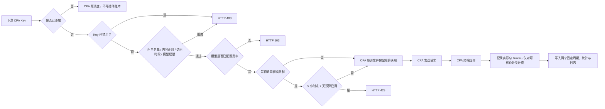

# codex-carpool

<!-- 插件中心与项目主页使用同一 Logo。 -->


**简体中文** | [English](README.en.md)

> 面向 [CLIProxyAPI](https://github.com/router-for-me/CLIProxyAPI) / CPA 的 Linux 原生全模型 Key 美元计量插件。


## 项目简介

插件只管理已添加下游 Key 的实际用量与美元预算，不维护账号池、不读取官方百分比、不使用倍率或积分。“额度限制”和“仅统计”都会持续记录请求正文摘要、模型、Token、费用以及固定 5 小时和 7 天周期，区别只是超额后是否返回 `429`；“禁用”会拒绝此 Key 的全部模型请求并保留对应请求日志。

CPA 仍负责认证文件和实际调度。未添加的 Key 保持 CPA 原有行为，外部流量不会写入插件，也不会被分摊到任何已添加 Key。

## 界面预览

截图来自中文界面；额度、模型和用量以实际部署环境为准。

### 用量总览与日志

已添加 Key 的 5 小时 / 7 天预算、Token、今日趋势与跨 Key 模型日排行集中展示；下方可查询使用、内容拦截和运行日志。


### 单 Key 用量分析

在“管理”中按时间和粒度查看预算刷新时间、成本拆分、Token 趋势及请求记录。


### Key 策略与独立 IP 白名单

额度设置包含 Key 状态、预算、CPA 当前模型目录中的允许模型及可选访问时段；IP 白名单使用独立开关，关闭后保留已填写的地址。


### 内容正则拦截

内置与自定义 RE2 表达式可搜索、逐条开关；新增表达式的输入区固定在列表下方。


## 核心能力

- **5 小时 / 7 天独立美元预算**：首个请求分别启动两个固定周期，后续请求不改变边界；到点整体归零，下一次请求再启动新周期。留空或填 `0` 表示不限制但仍统计。
- **完整模型费率**：按模型配置输入、缓存读取、缓存写入、推理和输出 USD / 百万 Token 价格；同步费率还支持上下文阶梯和 CPA 回调可识别的服务模式。
- **可选 [models.dev](https://models.dev/) 第三方价格同步**：默认关闭；开启后立即同步，之后每 24 小时更新一次，匹配 CPA 当前支持目录及费率表中人工添加的模型 ID；新增模型后会立即排队同步。同步时从模型元数据动态确认原始厂商，只采用该厂商同 ID 且具备完整 Token 价格的条目，不按模型名前缀猜测或采用转售价格；CPA 移除的模型不再仅凭旧同步费率继续进入同步，人工添加的模型则保留来源标记。未匹配的手工费率保留，同步失败则保留同步前的完整费率。models.dev 不是模型厂商官方报价，生产使用前应自行核对。
- **模型目录与权限**：Key 的允许模型只使用 CPA 当前实际支持的目录；费率表还可人工添加模型 ID 供价格匹配。每个 Key 可单独选择允许模型，不勾选表示不限制。未配置费率的模型暂停调用，全部价格为 `0` 即免费。
- **实际 Token 结算**：终端 CPA 回调提供输入、缓存读写、输出、推理及服务层级；插件按 Codex/OpenAI、Claude/Anthropic、Gemini 的 Token 语义去重计费，并立即写入两个固定周期。请求使用模型别名时，按该别名手工配置的费率结算。
- **总量与费用分开处理**：CPA 仅返回总 Token 而缺少分项时，仍统计总量；已知分项可可靠核价时仅计入这部分费用，未分类 Token 不估价。分项矛盾或缺失部分可能改变阶梯费率时，不对该请求估价或扣费；完全没有实际 Token 的请求不使用固定值补算。
- **完整审计**：添加到插件的 Key 即使选择“仅统计”，仍记录请求正文摘要、模型、实际 Token、已核价费用、CPA AuthID 和两个固定周期；超额请求继续放行。
- **Key 禁用**：禁用状态在模型、费率和 CPA 路由之前统一返回 `403`，不产生模型 Token 或费用，但仍记录 Key、模型、请求正文摘要和拒绝原因。
- **独立 IP 白名单**：每个已添加 Key 可单独启停，支持 IPv4、IPv6 地址及 CIDR 网段，多个地址用英文分号分隔；与是否启用额度限制无关。关闭时保留名单，开启后来源 IP 缺失或不匹配均拒绝并记入请求日志。反向代理须可信地覆盖 `X-Real-IP`，例如 Nginx 使用 `proxy_set_header X-Real-IP $remote_addr;`。
- **内容正则拦截、访问时段、用量分析**：内容拦截默认开启，使用内置及自定义 RE2 正则；每个 Key 可设置允许访问时段，趋势支持按小时、日、月、年查询。这些能力只作用于已添加 Key。
- **排行榜与日志诊断**：跨 Key 的模型日排行显示 Token、已核价 USD 与请求数；单 Key 请求日志支持时间范围、关键词筛选和分页。使用日志、内容拦截日志、运行日志分别可查，面板显示数据库与各类日志占用；超过 30 天的日志自动清理，有实际清理时写入运行日志。
- **CPA 样式隔离**：面板控件、搜索框、弹窗、表格和固定操作列均在插件作用域内适配明暗主题。

## 内容拦截范围

- 内置规则使用大小写不敏感的 RE2 正则，补充简繁中文、英语、日语、韩语、俄语、西班牙语、法语、德语、葡萄牙语、意大利语、阿拉伯语、印地语的明确有害请求表达；各语言覆盖深度不同，不等于支持所有语言和所有改写。
- 重点拦截破解授权/付费校验、盗取凭据、制作恶意程序、武器制造、未成年人性剥削、自伤指导。中英文另有诈骗、人肉骚扰、仇恨煽动、性暴力、露骨色情生成、恐怖袭击及人口贩运规则。
- 换脸/深度伪造覆盖色情换脸、非自愿裸照、AI 脱衣，以及换脸或声音克隆诈骗、绕过人脸/活体核验。正常授权的影视换脸、配音、伪造检测不因工具名称被拦截。
- 规则参考 [OpenAI 官方内容审核分类](https://developers.openai.com/api/docs/guides/moderation)与[网络安全检查说明](https://developers.openai.com/api/docs/guides/safety-checks/cybersecurity)，但它们是本项目维护的本地规则，不是 OpenAI 提供的正则列表，也不等同于完整政策执行或官方审核服务。授权破解属于本项目额外的使用限制；逆向、反编译、CTF、安全研究等词本身不触发拦截。
- 为减少误拦截，新增规则要求句首请求动作与风险目标组合，不添加“研究/测试”全局豁免。正则不能可靠理解引用、否定、上下文、任意混淆或图片本身；遇到误拦截可在内容拦截设置中禁用对应规则，也可添加自定义表达式。
- 升级并重启插件后自动补齐新增规则；新数据库默认开启，已有总开关和单条禁用状态不被覆盖。内容拦截仍只作用于已添加 Key，包括“仅统计”状态，命中返回 `403` 并写入独立内容拦截日志。不增加外部审核调用，不上传请求正文。

## 计量流程


```mermaid
flowchart LR
    K["下游 CPA Key"] --> P{"是否已添加"}
    P -- 否 --> N["CPA 原调度，不写插件账本"]
    P -- 是 --> D{"Key 已禁用？"}
    D -- 是 --> E403["HTTP 403，写请求日志"]
    D -- 否 --> F{"IP 白名单 / 内容正则 / 访问时段 / 模型权限"}
    F -- 拒绝 --> E403["HTTP 403"]
    F -- 通过 --> R{"模型是否已配置费率"}
    R -- 否 --> E503["HTTP 503"]
    R -- 是 --> M{"是否启用额度限制"}
    M -- 否 --> C["CPA 原调度并保留结算关联"]
    M -- 是 --> B{"5 小时或 7 天预算已满"}
    B -- 是 --> E429["HTTP 429"]
    B -- 否 --> C
    C --> U["CPA 发送请求"]
    U --> S["CPA 终端回调"]
    S --> L["记录实际总 Token；仅对可核价分项计费"]
    L --> W["写入两个固定周期、统计与日志"]
```

## 模型费率配置

新数据库不预置模型费率。在面板的“费率设置”中按需配置并保存，或自行开启 models.dev 价格同步；价格单位为 USD / 百万 Token。未配置费率的模型会暂停调用，显式配置为全 `0` 的模型视为免费。本次取消预置不会清除已有费率；启用的价格同步仍按原有规则更新费率。

## 数据与安全边界

- 原始 CPA API Key 不持久化，只保存 HMAC 指纹和最后四位展示信息。
- 只记录最新的用户请求文本摘要；图片生成读取 JSON `prompt`，图片编辑读取 multipart `prompt`，不会保存图片二进制、Base64、系统提示、工具内容或模型响应正文。
- 外部 Key 的回调在识别为非受管后直接忽略，不写入受管 Key 的用量、美元账本或统计。
- 数据只写入插件自己的 SQLite 目录：`/CLIProxyAPI/plugins/codex-carpool/data/codex-carpool.db`。
- 当前美元计费数据库会为同系列已有安装增量补齐新增字段；不承诺把早期不同结构的计量库自动转换为美元账本。升级前请备份数据库，首次安装则由插件创建空库。
- 插件安全重载时会检查点保存尚未收到终态回调的关联标记，重载后仍按原请求时间和原费率结算。
- 额度按 CPA 已完成并回调的实际用量结算；并发请求可能在任一请求完成前同时通过额度检查，因此预算是结算阈值与后续请求门禁，不承诺对单次或并发在途请求做预授权硬封顶。
- CPA 认证文件和调度器仍由 CPA 管理；插件不会创建或编辑账号池。

## 环境要求

- 构建环境：Linux amd64、Go 1.26+、支持 CGO 的 C 编译器、`make`、`zip` 和 Git。Go 最低版本来自本仓库的 `go.mod`。
- 运行环境：已启用原生插件、管理接口与用量回调能力的 CPA。这里不按 CPA 版本号设定固定上下限；请在实际使用的 CPA 版本上验证插件注册、请求拦截、结算回调和管理面板。缺少这些能力的旧版 CPA 无法使用本插件。

以 Debian / Ubuntu 的 Linux amd64 机器为例，先安装系统构建工具：

```bash
sudo apt-get update
sudo apt-get install -y build-essential make zip git ca-certificates
```

Go 请按 [官方 Linux 安装说明](https://go.dev/doc/install)安装 1.26 或更新版本，不要依赖发行版仓库一定提供所需版本。装好后检查：

```bash
go version
go env GOOS GOARCH CGO_ENABLED
gcc --version
make --version
zip -v
```

目标应为 `linux/amd64`，`CGO_ENABLED` 应为 `1`；若显示 `0`，在构建前执行 `export CGO_ENABLED=1`。SQLite 驱动和共享库构建需要 CGO 与 C 编译器。无需安装 Node.js 或 Python。其他 Linux 发行版请用其包管理器安装等价工具。

## 编译

首次获取源码时：

```bash
git clone https://github.com/lucky98556/codex-carpool.git
cd codex-carpool
```

在仓库根目录运行：

```bash
chmod +x build-linux.sh
VERSION=0.8.3 ./build-linux.sh
```

`0.8.3` 仅为截图对应的版本示例，实际构建时请替换为要发布的版本号。脚本会依次执行依赖校验、单元测试、竞态测试、`go vet`，然后生成共享库和 ZIP 包。

## 安装

以下以 CPA 运行环境中的 `/CLIProxyAPI/plugins` 为例；若通过 1Panel / Docker 部署，请确保宿主机插件目录正确挂载到该路径，且数据目录持久化。安装新版本前先备份数据库，并避免同时保留多个同名插件共享库。

```bash
VERSION=0.8.3
install -D -m 0755 \
  "dist/codex-carpool_${VERSION}.so" \
  "/CLIProxyAPI/plugins/linux/amd64/codex-carpool_${VERSION}.so"

mkdir -p /CLIProxyAPI/plugins/codex-carpool/data
chmod 700 /CLIProxyAPI/plugins/codex-carpool/data
```

CPA 只负责加载插件：

```yaml
plugins:
  enabled: true
  dir: /CLIProxyAPI/plugins
  configs:
    codex-carpool:
      enabled: true
      priority: 100
```

重启 CPA 后，在插件管理中确认“用量管理”已注册、已启用；打开面板并用一条测试请求核对日志和实际 Token 结算。旧版共享库应在确认新文件和数据库备份后移出插件扫描目录，确保同名插件只加载一个版本；数据目录保持可写。

### 可选：自定义插件源

如需在 Linux amd64 的 CPA 插件商店中查找本插件，可在现有 `config.yaml` 的 `plugins:` 段下添加本仓库的专属插件源；不要重复创建第二个 `plugins:` 段：

```yaml
plugins:
  enabled: true
  store-sources:
    - "https://raw.githubusercontent.com/lucky98556/codex-carpool/main/registry.json"
```

保存并重新加载 CPA 配置后刷新插件商店。此地址只列出本插件，不会复制官方目录；它是自定义源，不代表已在官方插件中心上架。当前 Release 仅提供 Linux amd64 安装包，其他平台无法从此源安装。已有的 `plugins.dir` 和 `plugins.configs` 配置请保留，不要用上面的示例覆盖。

## 初次配置

1. 在 CPA 管理面板打开“用量管理”，或访问 `/v0/resource/plugins/codex-carpool/panel`。
2. 点击“同步 CPA 模型”，确认模型目录来自当前 CPA。
3. 打开“费率设置”，选择手工维护完整费率，或开启 models.dev 价格同步；未匹配的别名仍可手工添加。
4. 新增 Key，设置状态、允许模型、可选访问时段和 5 小时 / 7 天美元预算；留空或 `0` 表示不限额。“仅统计”仍计算两个窗口与可核价费用，只是不因超额拦截；“禁用”拒绝全部模型请求但保留请求日志。
5. 如需限制来源，在该 Key 的“管理 → IP 白名单”中填写地址或网段并单独启用；未启用额度限制时也生效。
6. 使用日志确认实际 Token 和已核价费用；查看单 Key 用量分析、模型日排行和运行日志。

## 管理接口

| 方法 | 路由 | 用途 |
| --- | --- | --- |
| GET / PUT | `/v0/management/codex-carpool/setup` | 插件保留周期和运行设置 |
| GET | `/v0/management/codex-carpool/summary` | Key 美元窗口、已结算 Token 和状态 |
| GET / POST / PUT / DELETE | `/v0/management/codex-carpool/keys` | Key 策略管理 |
| PUT | `/v0/management/codex-carpool/keys/ip-whitelist` | 单 Key 独立 IP 白名单与开关 |
| POST | `/v0/management/codex-carpool/keys/reset?key_id=...` | 重置单个 Key 的美元用量，保留日志 |
| GET | `/v0/management/codex-carpool/analysis?key_id=...` | 单 Key 实际 Token 分析 |
| GET | `/v0/management/codex-carpool/model-ranking` | 跨 Key 模型日排行 |
| GET / DELETE | `/v0/management/codex-carpool/logs?key_id=...` | 使用日志查询与清理 |
| GET | `/v0/management/codex-carpool/log-storage` | 数据库与三类日志占用 |
| GET / DELETE | `/v0/management/codex-carpool/operation-logs` | 插件运行日志查询与清理 |
| GET / PUT | `/v0/management/codex-carpool/content-filter` | 内容正则设置 |
| GET / DELETE | `/v0/management/codex-carpool/forbidden-logs` | 内容拦截日志查询与清理 |
| GET / PUT | `/v0/management/codex-carpool/models` | CPA 模型目录同步 |
| GET / PUT | `/v0/management/codex-carpool/rates` | 完整模型 Token 费率 |
| PUT | `/v0/management/codex-carpool/rate-sync` | 开关 models.dev 价格同步 |

## 上线前检查

- 未纳入管理的 Key 仍走 CPA 原调度。
- 受管 Key 的未知费率模型返回 `503`；全部费率为 `0` 的模型不扣费。
- 5 小时或 7 天美元预算达到上限时返回 `429`，窗口恢复后自动允许。
- 完成回调后，使用日志和两个美元窗口记录实际总 Token；分项不足时只显示已核价费用，不凭总量猜价。
- 选择“仅统计”的已添加 Key 仍执行内容、时段、模型和费率校验，并完整累计 Token、费用及两个窗口；仅跳过预算超额拦截。
- 选择“禁用”的 Key 对任意模型返回 `403`，请求日志中的 Key、模型、正文摘要和 `key_disabled` 原因仍可查询。
- 已启用 IP 白名单的 Key 仅允许名单中的来源 IP；切换“额度限制”和“仅统计”不改变该开关。
- 日志页面分别显示三类日志容量，超过 30 天的记录自动清理并留下有效清理的运行日志。
- 不经过 CPA 的外部流量不会出现在受管 Key 统计中。
- 重启 CPA 后，费率、Key 策略、美元账本和日志仍保留。

## 许可证

本项目依据仓库中的 [LICENSE](LICENSE) 发布。
